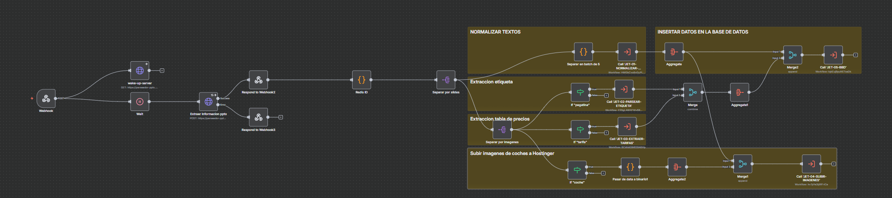

# n8n Workflow – PowerPoint Data Ingestion & Orchestration

This directory contains the n8n workflows responsible for orchestrating the end-to-end data ingestion pipeline from PowerPoint files into the platform database.

n8n acts as the central automation layer, coordinating backend services, AI agents, and data persistence in a fully automated and fault-tolerant workflow.

---

## Purpose of n8n in This Project

n8n is used as a **workflow orchestrator**, not as a simple automation tool. Its responsibilities include:

- Triggering the ingestion pipeline
- Coordinating backend API calls
- Managing data persistence
- Handling AI-based data normalization
- Ensuring reliable and traceable execution of the ingestion process

---

## Workflow Overview

The main workflow performs the following steps:

1. **Trigger**
   - HTTP Webhook or manual trigger to start the ingestion process
   - Receives metadata and references to the PowerPoint file

2. **Backend Processing**
   - Calls FastAPI endpoints responsible for:
     - Slide text extraction
     - Image extraction and processing
     - OCR of pricing tables
     - Computer vision–based image categorization

3. **Data Validation**
   - Validates extracted data structure and completeness
   - Handles error cases and partial failures gracefully

4. **AI-Powered Normalization**
   - Uses AI agents to:
     - Normalize inconsistent vehicle naming
     - Infer missing attributes
     - Convert unstructured text into structured schemas
     - Validate pricing and feature consistency

5. **Data Persistence**
   - Stores normalized data into the relational database
   - Associates uploaded vehicle label images with the correct vehicle records

6. **Final Status & Logging**
   - Returns execution status
   - Enables traceability and debugging of ingestion runs

---

## Workflow Diagram

This visual representation helps understand the orchestration logic and node dependencies.

---

## Key Design Decisions

- **Separation of concerns**:  
  Heavy processing (OCR, computer vision, file handling) is handled by the backend, while n8n focuses on orchestration and control flow.

- **Stateless orchestration**:  
  Each workflow execution is independent, allowing scalability and easier retry mechanisms.

- **AI as a normalization layer**:  
  AI agents are integrated as part of the workflow, not as a standalone feature, ensuring data consistency before persistence.

---

## Error Handling Strategy

- Conditional nodes handle partial failures
- Backend errors are captured and logged
- Workflow execution can be safely retried without data corruption

---

## Files

n8n/
├── workflows/
│ └── powerpoint_data_ingestion.json
└── README.md

yaml
Copiar código

- `powerpoint_data_ingestion.json`: Exported n8n workflow ready to be imported into an n8n instance

---

## How to Import the Workflow

1. Open your n8n instance
2. Go to **Workflows**
3. Click **Import from file**
4. Select `powerpoint_data_ingestion.json`
5. Configure environment variables and credentials if required

---

## Why n8n?

n8n was chosen for its:
- Visual clarity for complex workflows
- Strong API integration capabilities
- Flexibility in handling conditional logic
- Ease of maintenance and iteration

It enables rapid evolution of the ingestion pipeline without coupling orchestration logic directly to backend code.

---

## Notes

This workflow is designed as part of a larger automated system and assumes:
- A running FastAPI backend
- Proper environment configuration
- A relational database available for persistence
